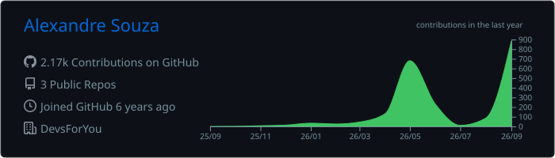

# Alexandre Souza

### Arquiteto de Software · Engenheiro de Software Sênior

**.NET · Sistemas distribuídos · Arquitetura de software · Produtos digitais**

Desenho e desenvolvo sistemas e produtos digitais, da arquitetura à operação. Tenho foco no ecossistema .NET, modernização de aplicações e soluções preparadas para evoluir.

[LinkedIn](https://www.linkedin.com/in/alexandre-roberto-souza-software-engineer/) · [DevsForYou](https://devsforyou.com.br/) · [SportsForYou](https://sportsforyou.com.br/)

---

## Sobre

Sou engenheiro de software e arquiteto de software. Trabalho com concepção, evolução e modernização de aplicações corporativas e produtos digitais — de decisões de arquitetura e implementação a integrações e infraestrutura.

Também desenvolvo produtos pela **[DevsForYou](https://devsforyou.com.br/)**, aplicando engenharia de software à criação de soluções digitais.

## Projetos

### [SportsForYou](https://sportsforyou.com.br/)

Plataforma digital para o ecossistema esportivo, conectando atletas, organizadores de eventos, parceiros e outros participantes. Inclui gestão de eventos, perfis personalizados, integrações externas e autenticação e autorização.

`C#` `ASP.NET Core` `.NET 10` `MySQL` `Bootstrap` `Docker` `Linux`

### [WorkTime](https://worktime.devforyou.com.br/)

Plataforma para conciliar e gerir apontamentos de horas, reunindo dados de jornada, equipes, férias, fechamentos, auditoria e relatórios. Integrações previstas ou implementadas incluem Ahgora, Businessmap/Kanbanize e Jira.

`C#` `.NET 10` `ASP.NET Core` `EF Core` `SQL Server` `Bootstrap`

### FingerBridge

Framework que abstrai SDKs de biometria digital e oferece uma camada comum para cadastro e validação de digitais em dispositivos de diferentes fabricantes.

`C#` `.NET Framework` `WinForms` `Biometria`

## Experiência técnica

- **Desenvolvimento:** C#, .NET, ASP.NET Core, APIs REST, Node.js, JavaScript e TypeScript
- **Arquitetura:** DDD, Clean Architecture, arquitetura modular, microsserviços e sistemas orientados a eventos
- **Web:** HTML, CSS, Bootstrap e interfaces responsivas
- **Dados:** SQL Server, MySQL, PostgreSQL, Redis e Entity Framework Core
- **Plataforma:** Docker, Linux, Azure, AWS, Cloudflare e CI/CD
- **Engenharia:** modernização de sistemas, integrações, desempenho, resiliência, segurança e observabilidade

## Temas de interesse

Sistemas distribuídos, SaaS, inteligência artificial aplicada ao desenvolvimento, automação, infraestrutura self-hosted, cloud computing, observabilidade e DevOps.

## GitHub

Parte da minha atuação acontece em repositórios privados e ambientes corporativos. O cartão de atividade abaixo é gerado por uma GitHub Action neste repositório.

## Contato

Estou aberto a conversar sobre arquitetura, engenharia de software e produtos digitais.

- [LinkedIn](https://www.linkedin.com/in/alexandre-roberto-souza-software-engineer/)
- [DevsForYou](https://devsforyou.com.br/)
- Belo Horizonte, Minas Gerais, Brasil
