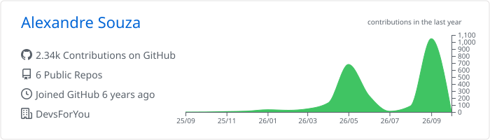

# Alexandre Souza

### Software Architect · Senior Software Engineer · AI Engineer

**.NET · Distributed Systems · Cloud Architecture · AI Engineering · Digital Products**

Desenho e desenvolvo sistemas e produtos digitais, da arquitetura à operação. Tenho foco no ecossistema .NET, modernização de aplicações e soluções preparadas para evoluir.

[LinkedIn](https://www.linkedin.com/in/alexandre-roberto-souza-software-engineer/) · [DevsForYou](https://devsforyou.com.br/) · [SportsForYou](https://sportsforyou.com.br/)

**Navegação:** [Sobre](#sobre) · [Projetos](#projetos-em-destaque) · [Engenharia de IA](#engenharia-de-ia) · [Competências](#compet%C3%AAncias-t%C3%A9cnicas) · [Segurança](#seguran%C3%A7a-aplicada) · [GitHub](#github) · [Contato](#contato)

---

## Sobre

Atuo em aplicações corporativas e também desenvolvo produtos pela **[DevsForYou](https://devsforyou.com.br/)**. Meu trabalho passa por arquitetura, implementação, integrações e infraestrutura.

## Projetos em destaque

Produtos digitais e projetos que mostram minha atuação em arquitetura, desenvolvimento e integração de sistemas.

<table>
  <tr>
    <td width="50%" valign="top">
      <h3><a href="https://sportsforyou.com.br/">SportsForYou</a></h3>
      
Plataforma para o ecossistema esportivo, conectando atletas, organizadores, comunidades e parceiros por meio de eventos, perfis e integrações.

      
<strong>Engenharia:</strong> arquitetura modular, qualidade automatizada, governança de dados, acessibilidade e SEO.

      
<code>C#</code> <code>ASP.NET Core</code> <code>.NET 10</code> <code>MySQL</code> <code>Docker</code>

      
<a href="https://sportsforyou.com.br/">Acessar produto</a> · <a href="https://github.com/ALRSO85/sportsforyou-showcase">Ver showcase técnico</a>

    </td>
    <td width="50%" valign="top">
      <h3><a href="https://worktime.devforyou.com.br/account/login">WorkTime</a></h3>
      
Plataforma de gestão e conciliação de apontamentos de horas, com jornadas, equipes, férias, fechamentos, auditoria e relatórios.

      
<strong>Integrações no escopo:</strong> Ahgora, Businessmap/Kanbanize e Jira.

      
<code>C#</code> <code>.NET 10</code> <code>ASP.NET Core</code> <code>EF Core</code> <code>SQL Server</code>

      
<a href="https://worktime.devforyou.com.br/account/login">Entrar no WorkTime</a>

    </td>
  </tr>
  <tr>
    <td valign="top">
      <h3><a href="https://doguinhos220v.com.br/">Doguinhos 220v</a></h3>
      
Portal pet com artigos, eventos, vídeos e recomendações de produtos. Desenvolvido por mim pela DevsForYou.

      
<strong>Engenharia:</strong> aplicação modular em PHP, painel administrativo, persistência JSON, SEO técnico e acessibilidade.

      
<code>PHP 8.5</code> <code>Bootstrap 5</code> <code>JavaScript</code> <code>JSON</code>

      
<a href="https://doguinhos220v.com.br/">Acessar Doguinhos 220v</a>

    </td>
    <td valign="top">
      <h3><a href="https://releasehub.devforyou.com.br/">ReleaseHub</a></h3>
      
Plataforma self-hosted para governança de mudanças e orquestração de releases em ambientes privados ou híbridos, conectando aprovações, execução, validação e auditoria.

      
<strong>Engenharia:</strong> rastreabilidade de artefatos e políticas de integridade para releases.

      
<code>.NET 10</code> <code>ASP.NET Core</code> <code>Docker</code> <code>SQL Server</code>

      
<a href="https://releasehub.devforyou.com.br/">Entrar no ReleaseHub</a>

    </td>
  </tr>
</table>

### Projeto open source

**[FingerBridge](https://github.com/ALRSO85/fingerbridge)** — Camada de integração biométrica para aplicações Windows em .NET Framework 4.8, com interface comum e providers independentes para leitores de diferentes fabricantes.

`C#` `.NET Framework` `WinForms` `Biometria` · [Explorar repositório](https://github.com/ALRSO85/fingerbridge)

## Engenharia de IA

Tenho aprofundado meus estudos em Engenharia de IA e experimentado LLMs em fluxos de desenvolvimento. No [showcase técnico do SportsForYou](https://github.com/ALRSO85/sportsforyou-showcase#ai-assisted-engineering), documento aplicações de apoio à revisão de código, documentação, análise de logs e planejamento de arquitetura.

## Competências técnicas

<table>
  <tr>
    <td width="50%" valign="top">
      <h3>Backend e APIs</h3>
      <code>C#</code> <code>.NET</code> <code>ASP.NET Core</code> <code>Node.js</code> <code>APIs REST</code>
    </td>
    <td width="50%" valign="top">
      <h3>Arquitetura</h3>
      <code>DDD</code> <code>Clean Architecture</code> <code>Sistemas modulares</code> <code>Microsserviços</code> <code>Eventos</code>
    </td>
  </tr>
  <tr>
    <td valign="top">
      <h3>Dados</h3>
      <code>SQL Server</code> <code>MySQL</code> <code>PostgreSQL</code> <code>Redis</code> <code>Entity Framework Core</code>
    </td>
    <td valign="top">
      <h3>Web</h3>
      <code>HTML</code> <code>CSS</code> <code>Bootstrap</code> <code>JavaScript</code> <code>TypeScript</code> <code>Interfaces responsivas</code>
    </td>
  </tr>
  <tr>
    <td valign="top">
      <h3>Cloud e entrega</h3>
      <code>Docker</code> <code>Linux</code> <code>Azure</code> <code>AWS</code> <code>Cloudflare</code> <code>CI/CD</code>
    </td>
    <td valign="top">
      <h3>Engenharia</h3>
      <code>Modernização</code> <code>Integrações</code> <code>Desempenho</code> <code>Resiliência</code> <code>Segurança</code> <code>Observabilidade</code>
    </td>
  </tr>
</table>

## Segurança aplicada

- **Doguinhos 220v:** senhas com bcrypt, proteção CSRF, sessões administrativas com cookies HttpOnly/SameSite, rate limiting e validação de uploads.
- **WorkTime:** ações protegidas contra CSRF, cookies de autenticação HttpOnly e políticas configuráveis de expiração, SameSite e Secure, além de rate limiting.
- **ReleaseHub:** validação de hashes SHA-256 e políticas configuráveis para exigir assinatura, proveniência e SBOM de artefatos.
- **[FingerBridge](https://github.com/ALRSO85/fingerbridge):** diretrizes documentadas para proteger dados biométricos, como não armazenar imagens nem registrar templates em logs e criptografar templates persistidos.

## Temas de interesse

Sistemas distribuídos, SaaS, inteligência artificial aplicada ao desenvolvimento, automação, infraestrutura self-hosted, cloud computing, observabilidade e DevOps.

## GitHub

Parte da minha atuação acontece em repositórios privados e ambientes corporativos. O cartão de atividade abaixo é gerado por uma GitHub Action neste repositório.

<picture>
  <source media="(prefers-color-scheme: dark)" srcset="./profile-summary-card-output/github_dark/0-profile-details.svg" />
  <source media="(prefers-color-scheme: light)" srcset="./profile-summary-card-output/github/0-profile-details.svg" />
  
</picture>

## Contato

Estou aberto a conversar sobre arquitetura, engenharia de software e produtos digitais.

- [LinkedIn](https://www.linkedin.com/in/alexandre-roberto-souza-software-engineer/)
- [DevsForYou](https://devsforyou.com.br/)
- Belo Horizonte, Minas Gerais, Brasil
